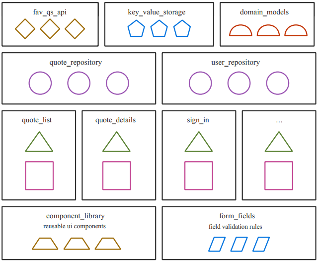

# Real-World Flutter Digest

## Chapter 1: Setting up Your Environment

- [flutter_dotenv](https://developer.school/tutorials/how-to-use-environment-variables-with-flutter-dotenv)



## Chapter 2: Mastering the Repository Pattern

```
packages/quote_repository
├── analysis_options.yaml
├── lib
│   ├── quote_repository.dart
│   └── src
│       ├── mappers
│       │   ├── cache_to_domain.dart
│       │   ├── domain_to_remote.dart
│       │   ├── mappers.dart
│       │   ├── remote_to_cache.dart
│       │   └── remote_to_domain.dart
│       ├── quote_local_storage.dart
│       └── quote_repository.dart
├── pubspec.lock
├── pubspec.yaml
└── test
    └── common_test.dart
```
`packages/quote_repository/lib/src/quote_repository.dart`:
```

```

## Chapter 3: Managing State With Cubits & the Bloc Library

## Chapter 4: Validating Forms With Cubits

## Chapter 5: Managing Complex State With Blocs

## Chapter 6: Authenticating Users

## Chapter 7: Routing & Navigating

## Chapter 8: Deep Linking

## Chapter 9: Internationalizing & Localizing

## Chapter 10: Dynamic Theming & Dark Mode

## Chapter 11: Creating Your Own Widget Catalog

## Chapter 12: Supporting the Development Lifecycle With Firebase

## Chapter 13: Running Live Experiments With A/B Testing & Feature Flags

## Chapter 14: Automated Testing

### Unit Tests

#### Writing Unit Tests for Mappers

#### Writing a Unit Test for Your Repository

#### Writing a Unit Test for API

#### Writing a BLoC Unit Test

### Writing a Widget Test

### Writing an Integration Test

## Chapter 15: Automating Test Executions & Build Distributions
